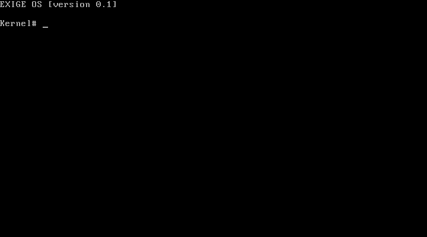

# ExigeOS

A minimal, didactic operating system kernel written in C, targeting both **x86** (32-bit protected mode) and **Raspberry Pi 3B** (AArch64).  ExigeOS is designed to be read and understood: every hardware mechanism is explained in the source code comments.

ExigeOS is a complete rewrite of **[Elise-OS](https://github.com/loicguillois/Elise-OS)** — a real-mode x86 OS in 16-bit assembly written in 2003.  The two projects together show how far the same ideas can evolve: from BIOS interrupts and real mode to direct hardware access and 32-bit protected mode.



---

## From Elise-OS (2003) to ExigeOS

| | Elise-OS | ExigeOS |
|---|---|---|
| **Language** | x86 assembly (NASM) | C (gcc) + boot stubs in assembly |
| **CPU mode** | 16-bit real mode | 32-bit protected mode (x86) / AArch64 (RPi3) |
| **Display** | BIOS `int 0x10` | Direct VGA memory write at `0xB8000` |
| **Keyboard** | BIOS `int 0x16` | PS/2 I/O port polling (`0x60`/`0x64`) |
| **Date / Time** | BIOS `int 0x1A` | CMOS RTC via I/O ports `0x70`/`0x71` |
| **Disk** | BIOS `int 0x13` | Not needed (Multiboot loads the kernel) |
| **Sound** | ASCII bell `0x07` | PIT channel 2 + port `0x61` |
| **Platforms** | x86 only | x86 + Raspberry Pi 3B |
| **Input buffer** | 7 chars (fixed) | 128 chars |

### Why ditch the BIOS?

Elise-OS uses **BIOS interrupts** for everything: `int 0x10` to print a character, `int 0x16` to read a keystroke, `int 0x1A` to read the clock.  This is the fastest way to get something on screen in real mode — the BIOS has already set up video, keyboard and clock for you.

ExigeOS runs in **32-bit protected mode**, where BIOS interrupts are unavailable (the CPU no longer switches back to real mode to call them).  Every piece of hardware must be driven directly by the kernel:

- **VGA**: write character + attribute bytes into memory at `0xB8000`.
- **Keyboard**: poll the PS/2 controller status register at port `0x64`, read scan codes from port `0x60`, translate through a software AZERTY table.
- **Clock**: send a register index to port `0x70`, read the BCD value from port `0x71`.
- **Sound**: program the PIT's channel 2 divisor, enable the speaker gate via port `0x61`.

This adds complexity but removes the BIOS as a black box — everything the OS does is visible in the source code.

---

## What you will learn from this codebase

| Topic | Where to look |
|---|---|
| x86 boot process (Multiboot) | `src/boot_x86.asm` |
| AArch64 boot (Raspberry Pi 3) | `src/boot_rpi3.S` |
| Linker scripts and memory layout | `src/linker_x86.ld`, `src/linker_rpi3.ld` |
| VGA text-mode display (80×25) | `src/vga.c`, `src/vga.h` |
| PS/2 keyboard polling | `src/keyboard.c` |
| PL011 UART I/O (RPi3) | `src/vga_rpi3.c`, `src/keyboard_rpi3.c` |
| PIT 8254: timing and PC speaker | `src/sound.c`, `src/sound.h` |
| CMOS real-time clock | `src/shell.c` |
| Freestanding C without a standard library | All `.c` files |

---

## How a kernel boots (x86)

```
Power on
  └─ BIOS runs (stored in ROM)
       ├─ POST: memory test, hardware enumeration
       ├─ Loads the first 512 bytes of the boot device (MBR) into 0x7C00
       └─ Jumps to 0x7C00 in real mode (16-bit)

  └─ Bootloader (GRUB / QEMU -kernel)
       ├─ Enters 32-bit protected mode
       ├─ Scans the first 8 KB of the kernel binary for the Multiboot header
       │    (magic = 0x1BADB002, flags, checksum)
       ├─ Loads the kernel at 1 MB (0x100000) as specified by the linker script
       └─ Jumps to _start with EAX=0x2BADB002 (Multiboot magic) in EBX

  └─ _start (src/boot_x86.asm)
       ├─ Sets up the stack (16 KB, below the kernel image)
       └─ Calls kernel_main() in C

  └─ kernel_main() (src/kernel.c)
       ├─ vga_init()      — initialise display
       ├─ keyboard_init() — initialise input
       └─ shell_run()     — enter command loop (never returns)
```

### Why 1 MB?

Real-mode BIOS code occupies the first 640 KB of physical memory (0x00000–0x9FFFF). The region 0xA0000–0xFFFFF is reserved for video memory and BIOS ROM. Placing the kernel at 1 MB (0x100000) gives clean, unambiguous access to all memory above that point.

---

## How a kernel boots (Raspberry Pi 3B)

```
Power on
  └─ GPU (VideoCore IV) runs from ROM
       ├─ Reads config.txt and kernel8.img from the SD card FAT partition
       └─ Loads kernel8.img at physical address 0x80000

  └─ All 4 Cortex-A53 cores start at 0x80000 simultaneously
       ├─ Core 0: proceeds to initialise the kernel
       └─ Cores 1-3: parked in a WFE (Wait For Event) loop

  └─ _start (src/boot_rpi3.S)
       ├─ Reads MPIDR_EL1 to identify the current core
       ├─ Parks cores 1-3 in WFE
       ├─ Sets the stack pointer to just below 0x80000
       ├─ Zeroes the BSS segment (required before calling C code)
       └─ Calls kernel_main()
```

### AArch64 vs x86

On x86, the BIOS initialises DRAM, sets up segment descriptors, and loads the bootloader before the kernel ever runs. On the Raspberry Pi, the GPU (VideoCore IV) acts as the first-stage bootloader. The ARM cores start in a relatively clean state, but the kernel must zero BSS itself (no BIOS to do it) and configure UART before it can output anything.

---

## Hardware mechanisms explained

### VGA text mode (x86)

The VGA controller exposes a 4000-byte memory-mapped framebuffer at **0xB8000**. Each character cell occupies 2 bytes:

```
 Byte 1 (attribute)    Byte 0 (character)
 ┌───┬───────┬───────┐  ┌──────────────────┐
 │ B │  BG   │  FG   │  │   ASCII code     │
 └───┴───────┴───────┘  └──────────────────┘
  bit7  6-4    3-0
  blink bg(0-7) fg(0-15)
```

The hardware cursor position is set by writing to **CRT Controller** registers via ports `0x3D4` (index) and `0x3D5` (data).

### PS/2 keyboard (x86)

The Intel 8042 PS/2 controller provides two I/O ports:
- **0x60** — Data: read scan codes, write commands.
- **0x64** — Status (read) / Command (write): bit 0 = output buffer full.

We poll bit 0 of port 0x64 until data is ready, then read the scan code from port 0x60. The keyboard sends **Scan Code Set 1**: make codes (bit 7 = 0) on key press, break codes (bit 7 = 1) on key release. We discard break codes and translate make codes through an AZERTY layout table.

### PIT 8253/8254 — PC speaker and timing

The Programmable Interval Timer has three 16-bit channels, all clocked at **1,193,180 Hz**:

| Channel | Port | Use |
|---------|------|-----|
| 0 | 0x40 | System timer (18.2 Hz IRQ0) |
| 1 | 0x41 | Obsolete (DRAM refresh) |
| 2 | 0x42 | PC speaker |

To play a tone at frequency F:
1. Write control word `0xB6` to port `0x43` (channel 2, Mode 3, 16-bit load).
2. Write `divisor = 1193180 / F` to port `0x42` (low byte then high byte).
3. Set bits 0–1 of port `0x61` to connect the PIT output to the speaker.

For real-time delays, we read PIT channel 0's counter by issuing a latch command (`0x00` → port `0x43`) and reading two bytes from port `0x40`. This gives microsecond-resolution timing without requiring interrupt handlers.

### CMOS Real-Time Clock (x86)

The CMOS chip holds a battery-backed clock accessible via:
- **Port 0x70** — Write the register index.
- **Port 0x71** — Read the value.

Values are stored in **BCD** (Binary Coded Decimal): `0x47` = 47 decimal.  Key registers: seconds (0x00), minutes (0x02), hours (0x04), day (0x07), month (0x08), year (0x09), century (0x32).

### PL011 UART (Raspberry Pi 3B)

The BCM2837 includes a PL011 UART at MMIO address **0x3F201000**.  Key registers:

| Offset | Register | Purpose |
|--------|----------|---------|
| 0x00 | DR | Data register (read/write character) |
| 0x18 | FR | Flags: bit 5 = TX FIFO full, bit 4 = RX FIFO empty |
| 0x24 | IBRD | Integer baud rate divisor |
| 0x28 | FBRD | Fractional baud rate divisor |
| 0x2C | LCRH | Line control: 8N1, enable FIFOs |
| 0x30 | CR | Control: enable UART, TX, RX |

Baud rate 115200 from 48 MHz UART clock: IBRD = 26, FBRD = 3.

---

## Project structure

```
ExigeOS/
├── Makefile                 # Build system (PLATFORM=x86|rpi3)
├── README.md
├── .gitignore
└── src/
    ├── boot_x86.asm         # x86 Multiboot entry point + stack setup
    ├── boot_rpi3.S          # AArch64 entry point + BSS zero + stack
    ├── linker_x86.ld        # x86 linker script (kernel at 1 MB)
    ├── linker_rpi3.ld       # RPi3 linker script (kernel at 0x80000)
    │
    ├── io.h                 # x86 I/O port access: inb() / outb()
    │
    ├── vga.h / vga.c        # VGA 80×25 text driver (x86)
    ├── vga_rpi3.c           # PL011 UART display driver (RPi3)
    │
    ├── keyboard.h
    ├── keyboard.c           # PS/2 keyboard driver, AZERTY (x86)
    ├── keyboard_rpi3.c      # UART keyboard driver (RPi3)
    │
    ├── sound.h
    ├── sound.c              # PC speaker driver via PIT (x86)
    ├── sound_stub.c         # No-op stubs for RPi3
    │
    ├── shell.h / shell.c    # Interactive command shell (both platforms)
    └── kernel.c             # kernel_main(): init sequence
```

---

## Dependencies

### x86 build

| Tool | Role | Install (Ubuntu/Debian) |
|------|------|------------------------|
| `gcc` (multilib) | C compiler (32-bit target) | `sudo apt install gcc-multilib` |
| `nasm` | x86 assembler (Multiboot stub) | `sudo apt install nasm` |
| `ld` (binutils) | Linker | `sudo apt install binutils` |
| `qemu-system-i386` | PC emulator | `sudo apt install qemu-system-x86` |

```bash
sudo apt install gcc-multilib nasm binutils qemu-system-x86
```

### RPi3 build (additional)

| Tool | Role | Install |
|------|------|---------|
| `aarch64-linux-gnu-gcc` | AArch64 cross-compiler | `sudo apt install gcc-aarch64-linux-gnu` |
| `qemu-system-aarch64` | ARM64 emulator | `sudo apt install qemu-system-arm` |

```bash
sudo apt install gcc-aarch64-linux-gnu binutils-aarch64-linux-gnu qemu-system-arm
```

---

## Build and run

```bash
# x86 (default)
make
make run

# Raspberry Pi 3B
make PLATFORM=rpi3
make PLATFORM=rpi3 run

# Clean all build artifacts
make clean
```

### Audio (x86)

The PC speaker is routed through QEMU's audio backend.  The Makefile defaults to **PipeWire**.  Adjust `QEMU_CMD` in the Makefile if your system uses a different backend:

| Audio system | Backend string |
|---|---|
| PipeWire | `pipewire` |
| PulseAudio | `pa` |
| ALSA | `alsa` |

To capture audio to a WAV file for inspection:

```bash
make run-wav
# then:
aplay /tmp/exigeos.wav
```

---

## Shell commands

| Command | Description |
|---------|-------------|
| `help` | List available commands |
| `cls` | Clear the screen |
| `date` | Display current date (from CMOS RTC) |
| `time` | Display current time (from CMOS RTC) |
| `note <notes>` | Play musical notes via PC speaker |
| `color <name>` | Change text foreground colour |
| `beep` | Visual screen flash |
| `reboot` | Hard reset the machine |

### Musical notes

Notes follow solfège naming.  Multiple space-separated notes play in sequence:

```
note do
note sol sol sol mi si sol mi si sol
note do re mi fa sol la si
```

Available notes: `do` `re` `mi` `fa` `sol` `la` `si`

### Colours

```
color white
color yellow
color lightgreen
```

Available colours: `black` `blue` `green` `cyan` `red` `magenta` `brown` `grey` `darkgrey` `lightblue` `lightgreen` `lightcyan` `lightred` `lightmagenta` `yellow` `white`

---

## Design decisions

**No memory allocator** — All data lives on the stack or in static arrays.  This keeps the kernel small and avoids the complexity of a heap manager.

**No interrupt handlers** — Both keyboard and timing use polling.  Simpler to understand, but wastes CPU cycles.  A real kernel would configure an IDT (x86) or GIC (AArch64) and handle hardware interrupts asynchronously.

**No paging** — The kernel runs with identity-mapped physical memory.  Implementing paging would require a page directory, page tables, and the `cr0`/`cr3` registers on x86.

**Freestanding C** — No standard library.  The kernel provides only what it needs: string comparison, integer formatting, I/O port access.

---

## Author

**Loïc Guillois** — [contact@loicguillois.fr](mailto:contact@loicguillois.fr)

---

## License

MIT — see [LICENSE](LICENSE).
